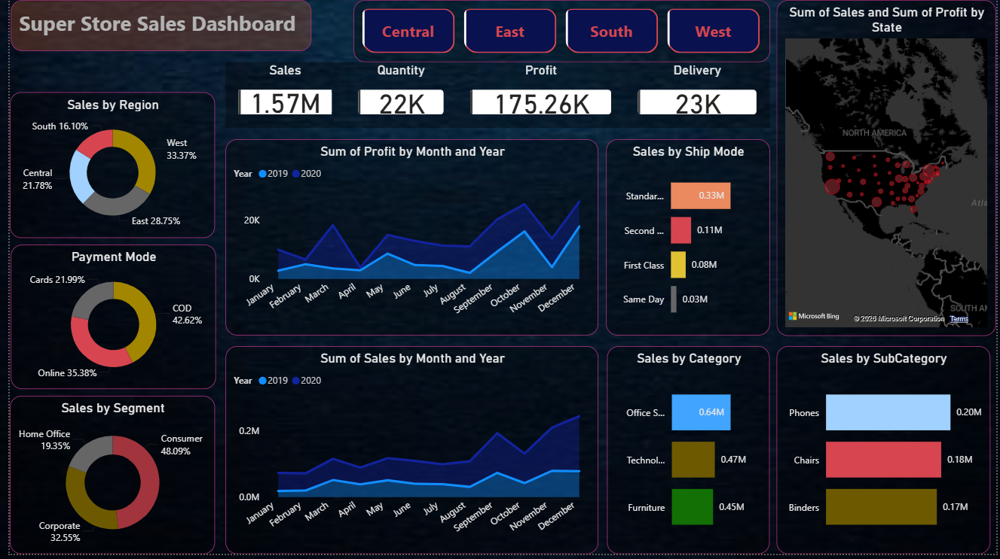

# Store-Sales-Dashboard
# 📊 Super Store Sales Dashboard

An interactive **Super Store Sales Dashboard** designed to analyze and visualize sales performance, profitability, customer segments, regional performance, product categories, payment modes, and shipping trends.

The dashboard provides a clear overview of key business KPIs and helps identify important sales and profit trends through interactive data visualizations.

---

## 📸 Dashboard Preview

---

## 🎯 Project Overview

This project focuses on analyzing Super Store sales data and presenting meaningful business insights through an interactive dashboard.

The dashboard allows users to explore sales performance across different:

- Regions
- Years and Months
- Customer Segments
- Payment Modes
- Shipping Modes
- Product Categories
- Product Sub-Categories
- States

---

## 📌 Key KPIs

| KPI | Value |
|---|---:|
| 💰 Total Sales | 1.57M |
| 📦 Total Quantity | 22K |
| 💵 Total Profit | 175.26K |
| 🚚 Total Delivery | 23K |

---

## 📈 Dashboard Features

### 🌎 Regional Analysis
- Sales distribution across Central, East, South, and West regions
- Regional contribution to overall sales

### 💳 Payment Mode Analysis
- COD
- Online
- Cards

### 👥 Customer Segment Analysis
- Consumer
- Corporate
- Home Office

### 🚚 Shipping Mode Analysis
- Standard Class
- Second Class
- First Class
- Same Day

### 📦 Product Analysis
- Sales by Category
- Sales by Sub-Category
- Identification of top-performing products

### 📅 Time-Series Analysis
- Monthly Sales Trends
- Monthly Profit Trends
- Year-over-Year comparison

### 🗺️ Geographic Analysis
- State-wise Sales and Profit visualization

---

## 🛠️ Tools & Technologies

- **Microsoft Power BI**
- **Power Query**
- **DAX**
- **Data Visualization**
- **Data Analysis**

---

## 📂 Project Files

- `SuperStore_Sales_Dataset.pbit` — Power BI dashboard/template file
- `Screenshot-Dashboard.png` — Dashboard preview
- `README.md` — Project documentation

---

## 💡 Business Insights

This dashboard helps users understand:

- Which regions generate the highest sales
- Monthly sales and profit trends
- Which customer segments contribute most to revenue
- Popular payment methods
- Performance of different shipping modes
- Best-performing product categories and sub-categories
- Geographic sales and profit distribution

---

## 🚀 Purpose

The main goal of this project is to transform raw sales data into an interactive and easy-to-understand business intelligence dashboard that supports **data-driven decision making**.

---

## 👤 Author

**Darain Asad**

GitHub: [@darainasad](https://github.com/darainasad)
